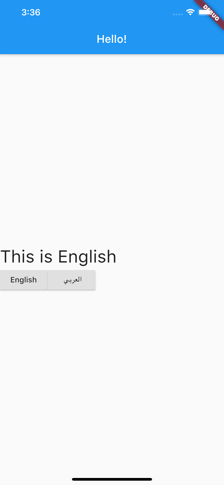
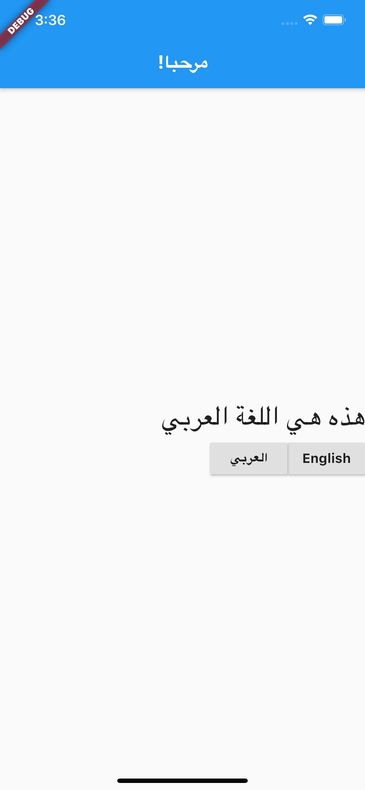

# i18n_provider_json

ENGLISH:   ARABIC:  

Ref. Tutorial:  
Flutter Internationalization the Easy Way — using Provider and JSON  
(https://medium.com/flutter-community/flutter-internationalization-the-easy-way-using-provider-and-json-c47caa4212b2)  

Ref. Github Repo:  
https://github.com/mohamedHassanKa/flutter_internationalization  

To solve `ServicesBinding.defaultBinaryMessenger was accessed before the binding was initialized.` error  
ServicesBinding.defaultBinaryMessenger was accessed before the binding was initialize  
https://github.com/mohamedHassanKa/flutter_internationalization/issues/3  

To test AxisAlignment  
Flutter crossAxisAlignment vs mainAxisAlignment  
https://stackoverflow.com/questions/53850149/flutter-crossaxisalignment-vs-mainaxisalignment  

## How to run  
`$flutter pub get`  
`$flutter doctor`  
`$flutter devices`  
`$flutter build ios`  
`$flutter run`  

### for web 
`$flutter channel beta`  
`$flutter upgrade`  
`$flutter create .`  
`$flutter build web` 
`$flutter run -d chrome`  

## Getting Started  

This project is a starting point for a Flutter application.

A few resources to get you started if this is your first Flutter project:

- [Lab: Write your first Flutter app](https://flutter.dev/docs/get-started/codelab)
- [Cookbook: Useful Flutter samples](https://flutter.dev/docs/cookbook)

For help getting started with Flutter, view our
[online documentation](https://flutter.dev/docs), which offers tutorials,
samples, guidance on mobile development, and a full API reference.
